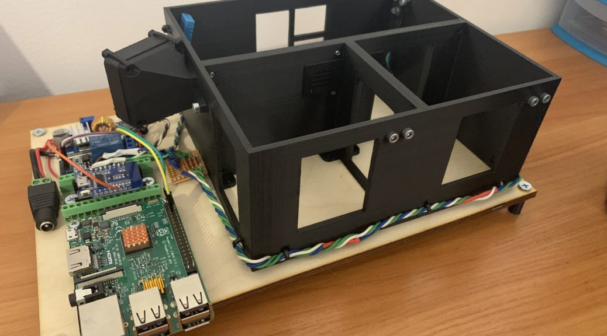

# openHab Smart house project 
This is Smart House project working on Raspberry Pi and Openhab. It gives you ability to remotely control light, temperature and ventilation.

## Layout
Layout of house was 3d printed and installed in laser-cutted wood plate. 3d models and dxf files you can find in **stl** directory.
## Hardware parts
This is the list of parts i used in this project:
```
Raspberry Pi 3b+
Wemos d1 mini
Relay module
Power contoller
12V Fan
LED - 3pcs
Wires
```
## Code 
OpenHab server is runned on Raspberry Pi and it connects with Wemos ESP8266 module by MQTT protocol. Wemos board handles and performs all commands.